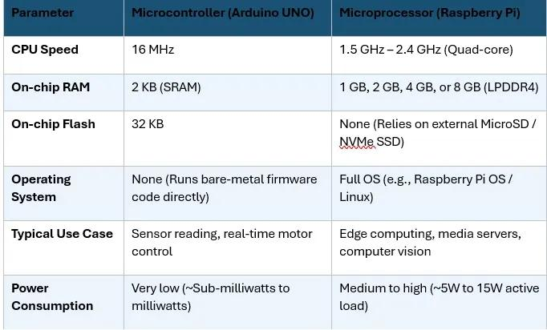

# Module 2 Written Theory Evaluations

## Q11. IoT Architecture Layers Blueprint
* **Perception Layer:** DHT11 Sensor (Collects physical temperature and humidity metrics)
* **Network Layer:** Wi-Fi Gateway (Transmits collected data packets securely over wireless protocols)
* **Processing Layer:** Cloud Broker (Parses incoming streams and executes data storage logic)
* **Application Layer:** Web UI (Displays visual graphs and analytics dashboards to the end-user)

---

## Q12. Microcontrollers vs. Microprocessors Target Specifications
Below is the verified target specification comparison matrix evaluating the differences between microcontrollers (like the Arduino Uno) and microprocessors (like the Raspberry Pi):

