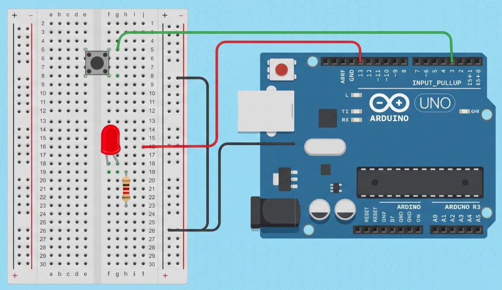

# Module 2 Written Theory Evaluations

## 🌐 Q11. IoT Architecture Layers Blueprint
* **Perception Layer:** DHT11 Sensor (Collects physical ambient temperature and relative humidity data points).
* **Network Layer:** Wi-Fi Gateway (Packetizes and routes the raw sensor streams across local networks safely).
* **Processing Layer:** Cloud Broker (Ingests telemetry queues, executes processing scripts, and coordinates DBMS tasks).
* **Application Layer:** Web UI (Exposes visual data analytics plots, gauge panels, and control widgets to supervisors).

---

## 💻 Q12. Microcontrollers vs. Microprocessors Target Specifications
Below is the verified target specification comparison matrix evaluating architectural and resource profiles between low-power microcontrollers (like the ATmega328P on the Arduino Uno) and single-board computer microprocessors (like the Broadcom SoC on the Raspberry Pi):

---

## 🔌 Q13a. Pin Type Allocations: Digital vs. Analog Inputs
* **Digital Inputs:** Read binary, two-state configurations corresponding to discrete logical states (`HIGH` or `LOW` / 5V or 0V). These are typically mapped to binary instruments like simple pushbuttons, toggles, PIR movement detectors, or magnetic window reed switches.
* **Analog Inputs:** Interface with continuously variable voltage curves spanning a gradient spectrum (e.g., 0V to 5V). Inside the ATmega328P, a built-in Successive Approximation **10-bit Analog-to-Digital Converter (ADC)** samples this continuous wave and transforms it into quantized integer variables ranging linearly from **0 to 1023**. Examples include Potentiometers, LDR photocells, and analog temperature sensors (LM35).

---

## ⏳ Q13b. Pushbutton Debouncing Mechanisms: Hardware vs. Software
When physical metal contacts inside a tactile switch close, they mechanically bounce against each other for a few milliseconds, creating rapid micro-oscillations between 0V and 5V. To prevent the microcontroller from reading a single button click as 10 rapid triggers, engineers use two stabilization techniques:

* **Hardware Debouncing:** A physical **Resistor-Capacitor (RC) Low-Pass Filter** circuit is placed across the button terminal pins. The capacitor absorbs and dampens the transient noise spikes, presenting a clean, smooth voltage transition curve directly to the digital input pin without using any CPU resources.
* **Software Debouncing:** The firmware introduces a timing constraint loop using software checks. The code samples a state change, initiates an internal non-blocking countdown window (typically 50ms to 200ms using the `millis()` function), and checks the pin again. The trigger is only processed if the signal remains stable at the end of the timing verification window.

---

## 🔌 Q19. analogWrite() vs. analogRead() and PWM Analysis
* **Functional Distinction:** `analogRead()` utilizes a 10-bit ADC to sample continuous input voltages (0-5V) across a 0-1023 integer range. `analogWrite()` outputs an 8-bit duty cycle square wave (0-255) to simulate a variable voltage using digital switching.
* **PWM Mechanics:** Pulse Width Modulation rapidly alternates output states at fixed frequencies. Adjusting the high-state duty-cycle width alters the average effective power delivered to components.
* **IoT Application Matrix:**
  * `analogRead()`: Mapping structural environmental telemetry values from an analog Soil Moisture sensor node into cloud databases.
  * `analogWrite()`: Adjusting lighting arrays on smart home fixtures from values received via cloud dashboard sliders.

---

## ⏳ Q20. Microcontroller Runtime Lifecycle and Non-Blocking Architectures
* **Function Routines:** `setup()` handles single-pass system configurations on boot. `loop()` maintains continuous execution of core program operations.
* **Thread Blocking Complications:** Long `delay()` sequences trap the program counter inside empty execution loops. Sensor read tasks are blocked, resulting in significant polling latency and missed real-time physical triggers.
* **Non-Blocking Architecture:** Utilizing `millis()` tracking to establish state flags. Program cycles verify elapsed delta timings against target milestones, executing timed events while keeping the loop running with zero processing delays.

### 🖼️ Q20 Visual Verification Appendix
Below is the circuit setup used to test real-time button response latency alongside a cycling indicator LED:

