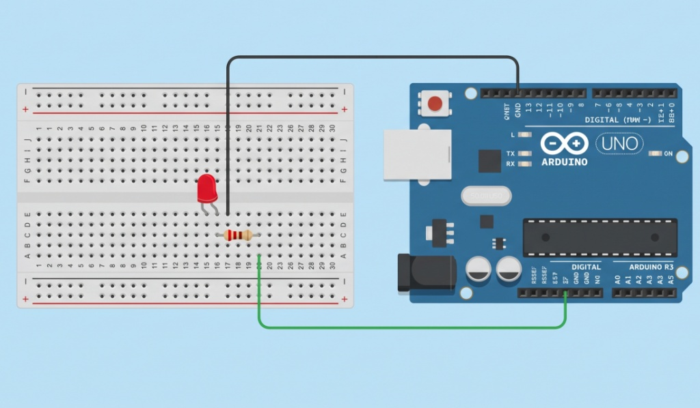

# Q4/Q5: Versioned Potentiometer-Controlled LED Blink System

## Project Description
This project demonstrates basic embedded system engineering principles using an Arduino Uno. It features an LED that adjusts its flashing speed dynamically based on the analog input read from a 10kΩ potentiometer. The system also outputs tracking metrics over a serial interface connection for diagnostic monitoring.

---

## 🛠️ Hardware Required
* **1x** Arduino Uno R3 Development Board
* **1x** Breadboard
* **1x** Red LED
* **1x** 220Ω Resistor (Current-limiting)
* **1x** 10kΩ Potentiometer (Analog Input)
* Solid-core hookup jumper wires

---

## 🔌 Circuit Diagram Description
The connections are wired securely onto the prototyping board using a shared common power scheme:
* **LED Loop:** The positive **Anode** leg of the LED connects directly to Arduino **Digital Pin 13**. The negative **Cathode** leg connects to one side of the **220Ω Resistor**, while the opposite side of the resistor plugs into the common **GND** rail.
* **Potentiometer Loop:** The left terminal terminal connects to the **5V** rail. The central wiper pin interfaces directly with Arduino **Analog Input A0**. The right terminal terminal connects to the common **GND** rail.

---

## 🖼️ Tinkercad Visual Reference Maps

### Baseline LED Blink Circuit (Q2)

### Potentiometer LED Speed Control Circuit (Q4)

